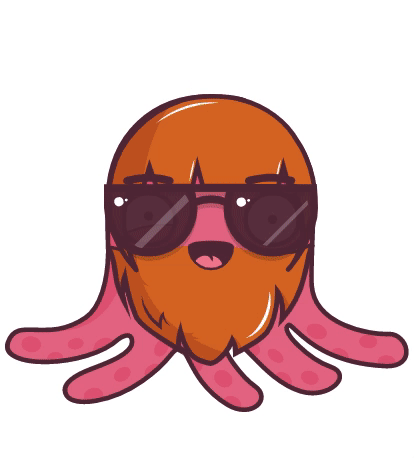

[](https://badge.fury.io/js/%40mavend%2Foctoheads)

# Octoheads

🐙 Generate octopus avatars

<p align="center" >
  
</p>

🍴 Fork of [RobertBroersma/bigheads](https://github.com/RobertBroersma/bigheads) project

## Getting Started

```shell
yarn add @mavend/octoheads
```

or

```shell
npm install @mavend/octoheads --save
```

then, in your app:

```jsx
import { OctoHead } from '@mavend/octoheads'

const Custom = () => (
  <OctoHead
    accessory="shades"
    circleColor="blue"
    eyebrows="angry"
    eyes="wink"
    facialHair="mediumBeard"
    hair="short"
    hairColor="black"
    hat="none"
    hatColor="green"
    lashes="false"
    lipColor="purple"
    mask="true"
    faceMask="true"
    mouth="open"
    skinTone="brown"
  />
)

const RandomWithSeed = () => (
  <OctoHead seed="user-id" />
)
```

## Contributing

Start storybook

```shell
yarn storybook
```
